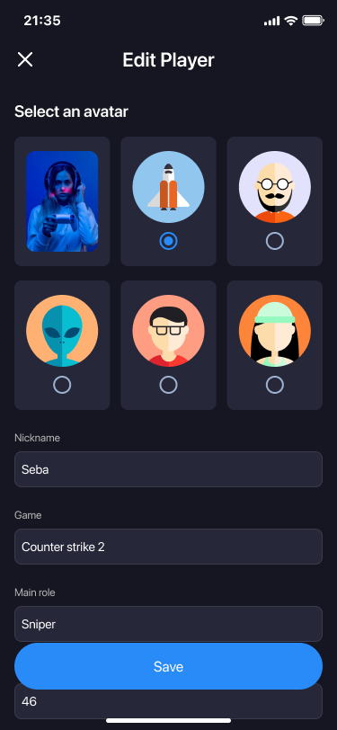

# EsportsAnalytix: Probe Oracle

**EsportsAnalytix** is a Flutter app that lets you log esports matches, track players, and forecast future outcomes. Designed for fans and analysts alike, it brings structured prediction, team stats, and personal accuracy tracking into one simple tool.


## 🛠️ Technologies

- **Flutter** and **Dart**
- **Provider** — state management
- **Hive** — local storage
- **Flutter ScreenUtil** — adaptive layout
- **Custom UI components** — match cards, avatars, guess tracker
- **Local assets** — avatars, role icons, and themes

## 📱 Screenshots

| Match History | Player Editor | Predictions |
|---------------|----------------|-------------|
|  |  |  |

## 🚀 How to Run

1. Clone the repo
   ```sh
   git clone https://github.com/NMMustafina/esportsanalytix_probe_oracle.git
   ```
2. Install all the packages by typing the following command
   ```sh
   flutter pub get
   ```
3. Run the App
